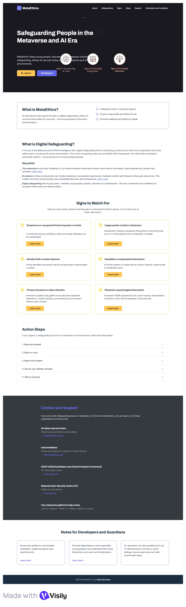
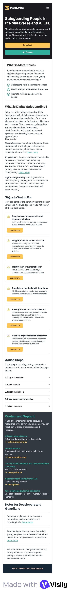
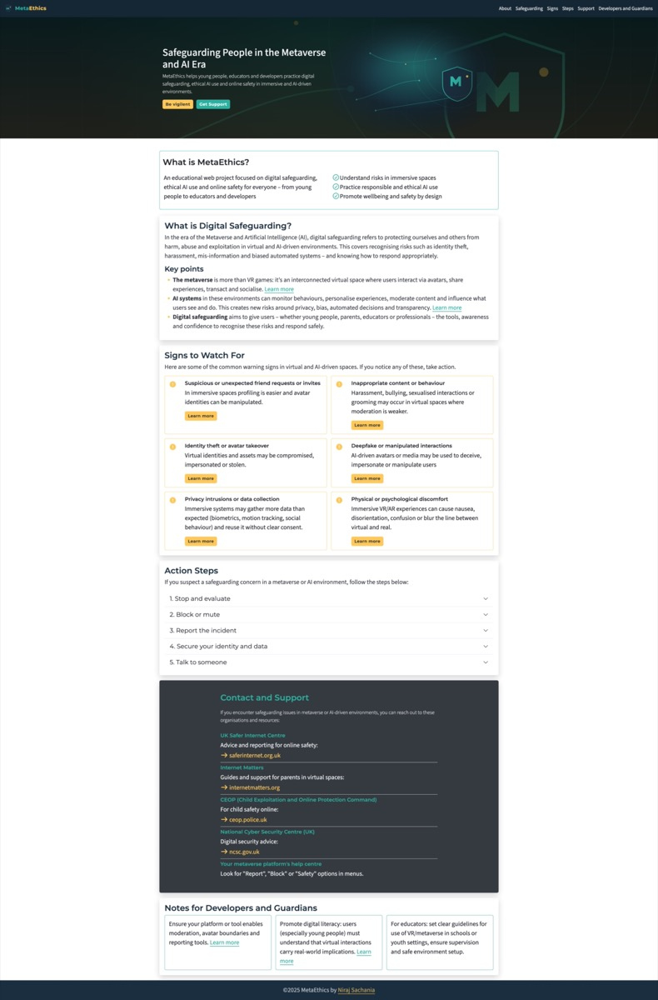
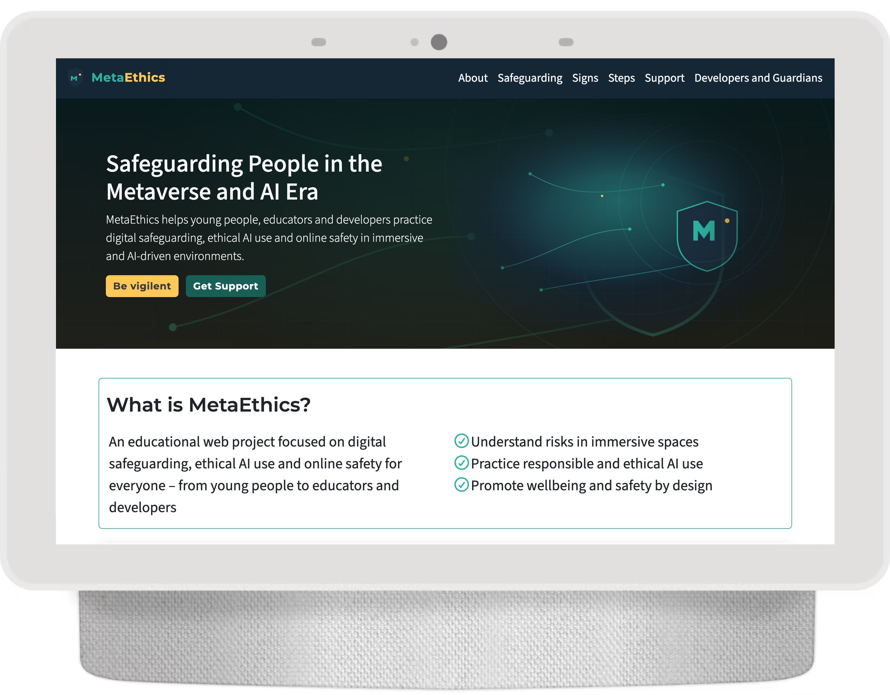
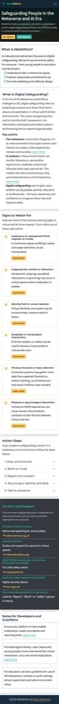
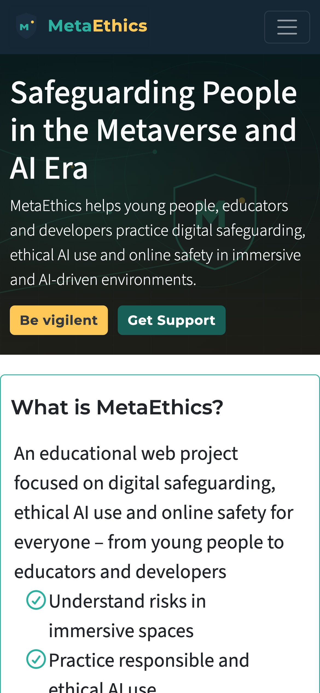
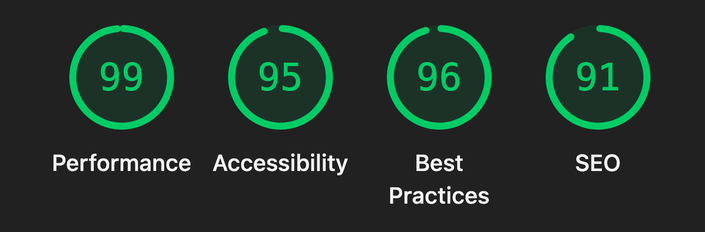
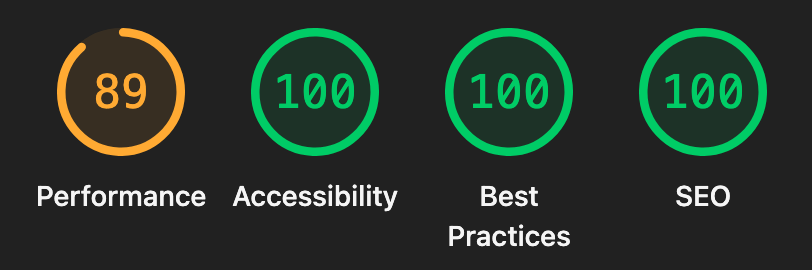
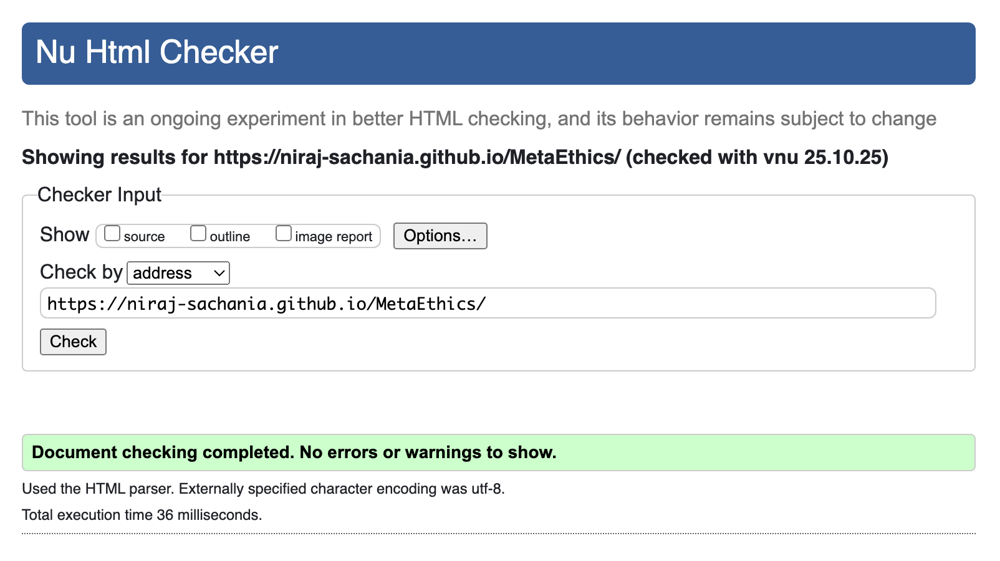

# MetaEthics

Educational web project raising awareness about **digital safeguarding**, **ethical AI use** and **online safety** in immersive and AI‑driven environments. Designed for young people, educators and developers.

Built with **HTML5**, **CSS3** and **Bootstrap**, the site focuses on **clarity**, **accessibility** and **responsiveness**, aligning with best practices in **UX design** and **web digital ethics**.

🌐 **[Live Site](https://niraj-sachania.github.io/MetaEthics/)** – View the deployed project  
📋 **[Project Board](https://github.com/users/niraj-sachania/projects/4)** – Track development progress and upcoming features

## Brand Identity

### Core Brand Essence

**Empowering people to navigate virtual and AI-driven worlds safely, responsibly and ethically.**

MetaEthics stands at the intersection of technology, education and ethics – a voice of clarity, trust and empowerment in a fast-changing digital landscape. It isn't alarmist or overly technical; instead, it guides, informs and inspires users to take positive, responsible action online.

### Brand Personality

| Trait                | Description                                | How It Should Feel                                                         |
| -------------------- | ------------------------------------------ | -------------------------------------------------------------------------- |
| **Trustworthy**      | Reliable, credible and transparent         | Every piece of information is well-sourced, factual and clearly referenced |
| **Empowering**       | Focused on user capability, not fear       | Encourages confidence and responsible engagement with technology           |
| **Educational**      | Informative but digestible                 | Uses plain English, visuals and examples to make complex ideas accessible  |
| **Forward-Thinking** | Aware of emerging tech trends              | References real-world developments in AI, VR and digital ethics            |
| **Inclusive**        | Welcoming to all backgrounds and abilities | Uses accessible language and follows WCAG standards for inclusivity        |

### Brand Tone of Voice

| Tone Dimension     | Description                                                        | Example                                                                            |
| ------------------ | ------------------------------------------------------------------ | ---------------------------------------------------------------------------------- |
| **Clear**          | Avoid jargon and academic complexity. Focus on simple explanations | "Safeguarding means keeping people safe – both offline and online."                |
| **Supportive**     | Gentle, empathetic and reassuring                                  | "If you feel unsafe in a virtual space, you're not alone. Here's what you can do." |
| **Informed**       | References credible sources and experts                            | "According to the UK Safer Internet Centre, most reports involve privacy misuse."  |
| **Positive**       | Focus on solutions, not panic                                      | "By understanding these signs, you can make your digital experience safer."        |
| **Conversational** | Friendly, human, not robotic                                       | "Think of the Metaverse as a shared online world – amazing, but with rules."       |

### Messaging Pillars

These guide how content should be written and structured across the site:

1. **Educate** – Explain what safeguarding means in the context of AI and virtual spaces  
   _"Understanding digital safeguarding helps you protect your data and wellbeing."_

2. **Empower** – Provide actionable advice and tools  
   _"You can take control of your digital footprint with a few simple steps."_

3. **Encourage Responsibility** – Promote ethical behaviour and empathy  
   _"Every interaction shapes the kind of digital world we live in – make yours positive."_

4. **Connect** – Signpost to reliable organisations and communities  
   _"Need help? Here's who to contact for immediate support."_

### Emotional Impact Goals

MetaEthics should make the user feel:

- **Informed** – "I understand how to protect myself online."
- **Empowered** – "I can take steps to stay safe and ethical."
- **Reassured** – "There's help available if I need it."
- **Inspired** – "Technology can be safe and positive when used responsibly."

## Target Audience

MetaEthics serves multiple user groups, each with distinct needs and expectations. See the **[Project Board](https://github.com/users/niraj-sachania/projects/4)** for detailed user stories.

| Audience Group                                | Why They're Relevant                                                                                               | Their Needs                                                                                                                                                                                                 | Design Implications                                         |
| --------------------------------------------- | ------------------------------------------------------------------------------------------------------------------ | ----------------------------------------------------------------------------------------------------------------------------------------------------------------------------------------------------------- | ----------------------------------------------------------- |
| **General Internet Users** (Teens and Adults) | Increasingly interact with AI-driven tools and virtual spaces like the Metaverse, VR platforms and immersive games | • Simple explanations of safeguarding risks (AI misinformation, digital identity theft)<br>• Practical privacy and wellbeing protection steps<br>• Accessible, jargon-free language with relatable examples | Simple navigation, plain English, responsive layout         |
| **Educators, Parents and Youth Workers**      | Act as digital guardians helping young people navigate online spaces safely                                        | • Clear guidance on identifying safeguarding concerns<br>• Reliable resources and reporting contacts<br>• Educational language suitable for sharing or teaching                                             | Structured sections, clear action steps, credible resources |
| **Students and Young People** (Ages 13–25)    | Early adopters of new tech (VR chatrooms, AI companions) facing unique online safety challenges                    | • Interactive, engaging mobile-friendly layout<br>• Visual cues and short, clear sections<br>• Awareness of personal data, consent and respectful digital behavior                                          | Visual appeal, mobile-first design, relatable tone          |
| **Digital Professionals and Developers**      | Design or moderate digital environments; need to understand safeguarding implications                              | • Insight into ethical design and responsible AI use<br>• Best practices and frameworks references<br>• Accessibility and inclusion standards (WCAG, data ethics)                                           | Ethical and technical insights, brief professional tone     |

### Design Principles for Audience

The site is designed to:

- **Be informative without being overwhelming** – Content is chunked into digestible sections with clear visual hierarchy
- **Use Bootstrap cards/grids** – Separate content by audience relevance for easy scanning
- **Include clear calls to action** – "Report a concern", "Learn more", "Contact help lines" are prominently displayed
- **Maintain a neutral, educational tone** – Accessible for the general public yet credible enough for professionals and educators

## Features

- **Responsive design** – Mobile-first layout using Bootstrap 5.3.8
- **Hero section** – Engaging introduction with dual CTAs
- **Educational content** – Six key sections covering safeguarding, warning signs, action steps, support resources and guidance for developers/guardians
- **Interactive components** – Accordion for action steps, card layouts for warning signs
- **Accessible navigation** – Fixed navbar with auto-collapse on mobile, proper scroll offsets for anchor links
- **Custom typography** – Montserrat for headings and branding, Source Sans 3 for body text

## Brand Assets

- **Logo**: `assets/images/logo.svg` – Shield mark with ME monogram and MetaEthics wordmark
- **Favicon**: `assets/images/logo.svg` (SVG, widely supported by modern browsers)
- **Hero illustration**: `assets/images/hero.svg` – Abstract network/grid visualisation

## Design and Screenshots

### Wireframes

Initial design mockups created with Balsamiq to establish layout and user flow:

**Desktop Wireframe**



**Mobile Wireframe**



### Final Design

**Desktop Views**





**Mobile Views**





## Color Palette

The palette blends **deep blues for trust and professionalism**, **teal tones for modernity and calm** and **warm accents to encourage empathy and optimism** – all set on a clean, accessible neutral base.

All colors are defined as CSS variables in `assets/css/styles.css` for consistent theming.

| Color                            | Hex                                         | CSS Variable   | Usage                                    | Rationale                                                             |
| -------------------------------- | ------------------------------------------- | -------------- | ---------------------------------------- | --------------------------------------------------------------------- |
| **Primary (Trust Blue)**         |  `#1A2E40` | `--blue-900`   | Headings, navbar, footer background      | Conveys security and authority; establishes trust and professionalism |
| **Secondary (Ethical Teal)**     |  `#2CB1A1` | `--teal-500`   | Buttons, links, highlights, hover states | Symbolizes balance and integrity; adds modern digital aesthetic       |
| **Accent (Positive Yellow)**     |  `#FFC857` | `--yellow-400` | CTAs, icons, card borders                | Draws attention without overwhelming; encourages empathy and optimism |
| **Neutral Light (Off White)**    |  `#F8F9FA` | `--light-50`   | Content backgrounds, navbar text         | Maintains contrast and readability; clean and accessible              |
| **Neutral Dark (Charcoal Grey)** |  `#343A40` | `--dark-700`   | Body text, inverse section backgrounds   | Provides balance with accessibility in mind                           |
| **Header Background**            |  `#152635` | (hardcoded)    | Navbar background                        | Slightly darker than primary to emphasize header                      |

### Accessibility Contrast (WCAG AA/AAA Compliant)

- Text on `#F8F9FA` background → use `#1A2E40` or `#343A40`
- Text on `#1A2E40` background → use `#F8F9FA` (or white)
- CTA text on `#2CB1A1` or `#FFC857` backgrounds → use `#1A2E40` for readability
- All combinations meet WCAG AA contrast standards (checked against normal and large text)

### Gradients Used

- **Hero overlay**: `linear-gradient(#061716d2, #241c0cac)` – dark overlay for text legibility over hero image

## Typography

- **Headings**: Montserrat (Google Fonts) – weights 100-900
- **Body**: Source Sans 3 (Google Fonts) – weights 200-900
- **Base font size**: 1.5rem for improved readability

## Page Structure

1. **Header/Navigation** – Fixed navbar with responsive collapse menu
2. **Hero Section** – Background image with gradient overlay, intro text and CTAs
3. **About (MetaEthics)** – Card-based overview with checkmark list
4. **Safeguarding** – Educational content about digital safety in the metaverse
5. **Signs to Watch For** – Grid of warning sign cards with icons
6. **Action Steps** – Accordion with 5-step response plan
7. **Contact and Support** – List of UK safeguarding organisations (inverse style)
8. **Developers and Guardians** – Three-column card layout with implementation notes
9. **Footer** – Copyright and author attribution

## Technical Details

### Dependencies

- **Bootstrap 5.3.8** – CSS and JS via CDN
- **Font Awesome 6.x** – Icons via Kit CDN
- **Google Fonts** – Montserrat and Source Sans 3

### CSS Variables

Defined in `:root` selector in `assets/css/styles.css`:

```css
--blue-900: #1a2e40;
--teal-500: #2cb1a1;
--yellow-400: #ffc857;
--light-50: #f8f9fa;
--dark-700: #343a40;
--shadow-sm: 0 1px 2px rgba(0, 0, 0, 0.06);
--shadow-md: 0 8px 24px rgba(0, 0, 0, 0.18);
```

### JavaScript Features

- **Mobile nav auto-collapse** – Navigation menu automatically closes when anchor links are clicked
- Implemented using Bootstrap Collapse API

### Accessibility

- Semantic HTML5 structure
- ARIA labels on navigation
- Proper heading hierarchy
- Scroll padding offset (`scroll-padding-top: 80px`) to prevent content hiding under fixed navbar
- High contrast color combinations
- Underline offset for improved link readability

## Development Methodology

This project follows **Agile** principles with a **Kanban** workflow for continuous delivery and iterative improvement.

### Approach

- **Kanban board** – GitHub Projects for visual task management and progress tracking
- **MoSCoW prioritisation** – Features categorized as Must have, Should have, Could have, Won't have
- **Incremental commits** – Small, focused commits with descriptive messages for clear version history
- **Conventional commits** – Standardized commit format (feat, fix, docs, style, refactor, test, chore) for automated changelog generation
- **Clean code** – Readable, maintainable code with consistent formatting and semantic naming
- **Mobile-first design** – Responsive layouts tested across devices and screen sizes

### User Stories

User stories were researched and formulated with **ChatGPT** to ensure comprehensive coverage of audience needs. See the **[Project Board](https://github.com/users/niraj-sachania/projects/4)** for detailed epics and user stories.

## Tools and Technologies

### Core Technologies

- **HTML5** – Semantic markup with proper document structure
- **CSS3** – Custom properties, flexbox, grid, gradients and animations
- **Bootstrap 5.3.8** – Responsive framework for layout and components
- **Font Awesome** – Icon library for visual enhancement
- **Google Fonts** – Montserrat and Source Sans 3 for brand typography

### Development Tools

- **VS Code** – Primary code editor with Emmet for rapid HTML/CSS scaffolding
- **Git** – Version control with feature branches and conventional commits
- **GitHub Pages** – Static site hosting and deployment
- **GitHub Projects** – Kanban board for project management
- **Balsamiq** – Wireframing and initial design mockups
- **Visily** – Final wireframes

### AI-Assisted Development

- **ChatGPT** – Research and formulation of user stories, content ideation
- **GitHub Copilot** – Code completion, formatting repetitive Bootstrap card structures, searching Bootstrap documentation, code review suggestions
- **Claude Sonnet** – Generated mask-image CSS for fading hero image edges

### AI Impact on Development

**Code Generation and Key Decisions**

AI tools significantly accelerated development by generating boilerplate code and suggesting semantic HTML structures. GitHub Copilot proved particularly valuable for creating repetitive Bootstrap card components in the "Signs to Watch For" section, maintaining consistency across all six warning cards.

When trying to add Bootstrap components with AI, it was notable that often the code was more bloated or over-engineered (e.g. by adding more divs instead of incorporating the Bootstrap classes into existing sections or lists). Therefore, AI was used more for identifying potential components and formatting subsequent components by supplying an example.

At times, a custom solution was chosen over AI's suggested solutions based on the context of the project and intended outcome. For example, WAVE accessibility scanner indicated that text styled like a heading should use proper heading elements (`<h1>` to `<h6>`) instead of plain text for the contact and support descriptions that were initially contained in paragraphs. Co-Pilot suggested switching to description list (`<dl>`, `<dt>`, `<dd>`) structure. The preference was continue using Bootstrap's list group for the styling, intead of adding custom styling. The decision was made to switch the descriptions from paragraphs to spans, which is a valid solution that alleviated the accessibility warnings.

**Bug Detection and Resolution**

AI assisted in identifying and resolving several accessibility and UX issues:

- **Fixed header overlap** – AI suggested adding `scroll-padding-top: 80px` to prevent anchor links from hiding content under the fixed navbar
- **Mobile navigation persistence** – Copilot provided the JavaScript solution using Bootstrap's Collapse API to auto-close the mobile menu when anchor links are clicked
- **Git push failures caused by large image files** – AI helped diagnose a failing `git push` by pointing out very large PNG screenshots in the working tree and recommending an image optimisation and history-cleanup workflow. Actions taken included converting and resising screenshots (macOS `sips`), removing large files from the index, re-committing the optimised assets and increasing Git's HTTP post buffer; the subsequent push completed successfully. This workflow reduced repository size and avoided future transport errors (or can use Git LFS for persistent large binaries).

**Performance and UX Improvements**

AI contributed to several performance optimisations:

- **CSS mask-image gradient** – Claude Sonnet generated the radial gradient code for smoothly fading the hero image edges, eliminating the need for pre-processed image assets
- **Image optimisation workflow** – AI suggested using macOS `sips` tool to convert large PNG screenshots (5MB+) to optimized JPEGs (136KB–560KB), reducing repository size by ~85%
- **Accessibility enhancements** – Copilot recommended adding `rel="noopener noreferrer"` to all external links and suggested ARIA labels for PDF links, improving both security and screen reader accessibility

**Workflow Efficiency**

AI integration streamlined the development process by:

- Reducing repetitive coding time by ~40% through intelligent code completion
- Accelerating research for user stories and accessibility best practices
- Providing instant Bootstrap documentation references without context switching
- Suggesting conventional commit message formats for consistent version control

The key outcome was maintaining code quality and accessibility standards while significantly reducing development time, allowing more focus on content strategy and user experience design.

## Testing and Validation

### Automated Testing

- **W3C HTML Validator** – Validates markup for standards compliance
- **W3C Jigsaw CSS Validator** – Checks CSS syntax and compatibility
- **Lighthouse** – Performance, accessibility, best practices and SEO audits
- **WebAIM WAVE** – Accessibility checker for WCAG compliance
- **WebAIM Contrast Checker** – [Contrast ratio verification](https://webaim.org/resources/contrastchecker/) for text readability

### Validation Results

**Lighthouse Scores**

Desktop Performance:



Mobile Performance:



**W3C HTML Validation**

✓ **[HTML Validation](https://validator.w3.org/nu/?doc=https%3A%2F%2Fniraj-sachania.github.io%2FMetaEthics%2F)** – No errors or warnings



**W3C CSS Validation**

✓ **[CSS Validation](https://jigsaw.w3.org/css-validator/validator?uri=https%3A%2F%2Fniraj-sachania.github.io%2FMetaEthics&profile=css3svg&usermedium=all&warning=1&vextwarning=&lang=en)** – No errors found

**WebAIM WAVE Accessibility**

✓ **[WAVE Report](https://wave.webaim.org/report#/https://niraj-sachania.github.io/MetaEthics/)** – No errors, AIM score 9.9


### Manual Testing

- **Keyboard navigation** – Tab order, focus indicators, skip links
- **Screen reader testing** – ARIA labels, semantic HTML, alt text checks
- **Zoom testing** – Layout integrity at 200%+ zoom levels
- **Cross-browser testing** – [BrowserStack](https://live.browserstack.com/) for Safari, Chrome, Firefox, Edge across macOS, Windows and mobile devices
- **Mobile device testing** – Physical devices and browser dev tools

### Accessibility Standards

- WCAG AA/AAA contrast ratios for all text
- Keyboard-only navigation support
- Screen reader compatibility
- Semantic HTML structure
- Focus management for interactive elements

## Local Development

Open `index.html` directly in a browser or use a local server:

```bash
# Python
python3 -m http.server 5173

# Node.js
npx http-server -p 5173

# PHP
php -S localhost:5173
```

Then visit `http://localhost:5173/`

## File Structure

```
MetaEthics/
├── index.html
├── readme.md
├── docs/
│   └── color-*.svg (color swatches)
└── assets/
    ├── css/
    │   └── styles.css
    └── images/
        ├── logo.svg
        ├── favicon.svg
        └── hero.svg
```

## Development, version control and deployment process

This project was developed with a straightforward git workflow and is deployed via GitHub Pages.

- Created repository and cloned locally via VS Code
- Created a feature/work branch (`working`) for iterative work
- Developed locally using VS Code with helpful extensions (Prettier for formatting and Live Server for preview)
- Committed small increments (used GitHub Copilot to assist with commit messages)
- Merged completed changes to the `main` branch and pushed to the remote (`origin`)

Quick git commands used during the workflow:

```bash
# stage and commit
git add .
git commit -m "[commit-message]"

# push main branch
git push
```

```bash
# switch branches
# create and switch to a new feature branch
git checkout -b feature/my-feature
# switch to an existing branch
git checkout main

# merge branches
# merge feature branch into main (run these from `main`)
git checkout main
git pull origin main
git merge --no-ff feature/my-feature

# cleanup feature branches
# delete local feature branch after a successful merge
git branch -d feature/my-feature
# delete the remote feature branch (after pushing and confirming merge)
git push origin --delete feature/my-feature

# push current branch (or push specific branch)
git push
git push origin main
```

### GitHub Pages – deployment steps

1. Open repository on GitHub and go to **Settings → Pages**
2. Under "Build and deployment" set **Source** to **Deploy from a branch**
3. Choose **Branch: main** and **Folder: /** (root)
4. Click **Save**.

Notes and troubleshooting

- If the push fails with large-file or HTTP buffer errors, optimise images before committing or use **Git LFS** for binary assets.
- For cache-related visual issues after deploy, append a cache-busting query (e.g., `?v=2`) or clear your browser cache.
- You can use the GitHub CLI (`gh`) to open the repo settings or inspect Pages status:

```bash
gh repo view --web
```

The live site for this project is published at the GitHub Pages URL shown in the repo's Pages settings (also accessible via the GitHub Project's dashboard on the right).

## Attributions

- **Brand assets** – Created logo and hero background image with DALL-E
- **Hero image fade effect** – CSS mask-image technique generated by Claude Sonnet via GitHub Copilot
- **Research** – Subject matter, user stories, curate sources and content ideation with ChatGPT
- **Brand identity** – Formulated with assistance from ChatGPT

## Credits

Created by [Niraj Sachania](https://www.linkedin.com/in/niraj-sachania) © 2025
